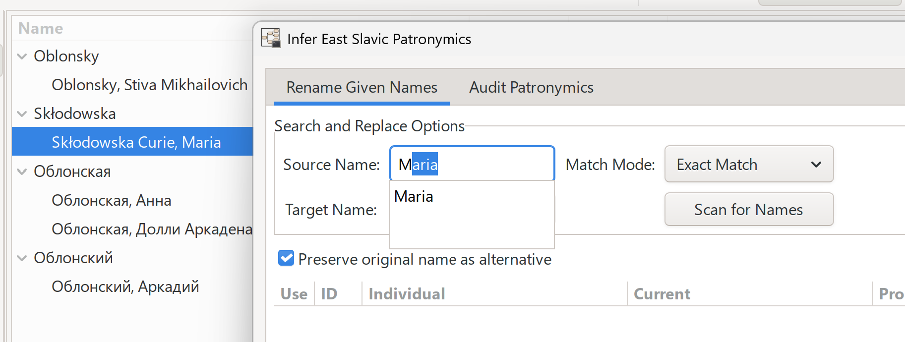
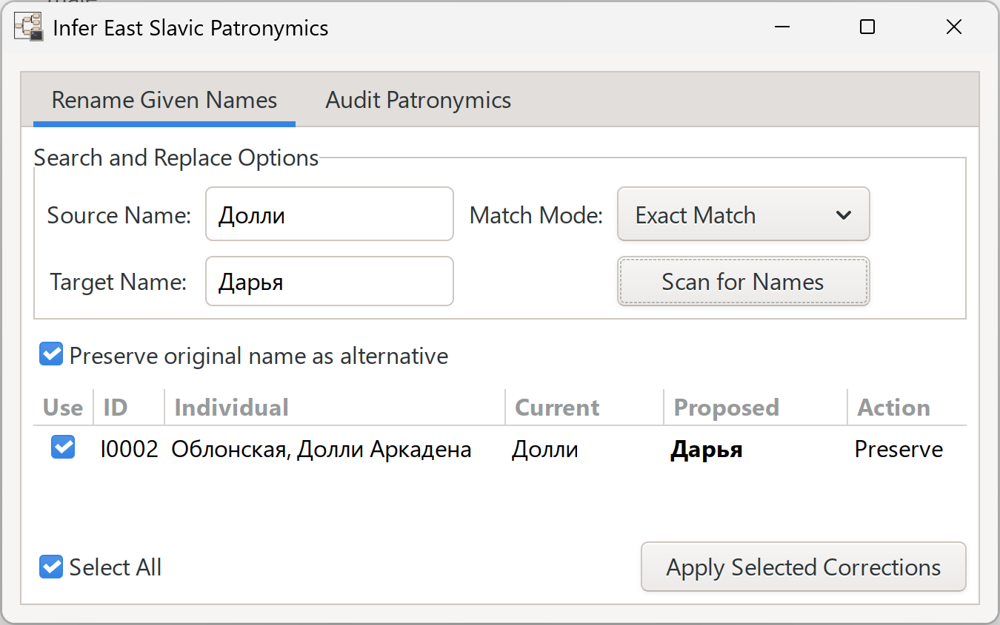
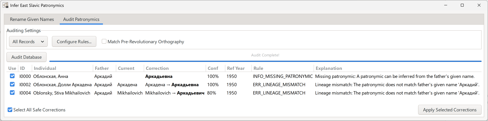
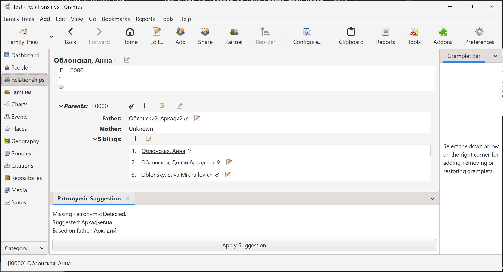

# Name Standardization Suite for Gramps

Welcome to the Name Standardization Suite! This is an addon for Gramps that helps you clean up, fix, and fill in missing names across your entire family tree. It is especially helpful for East Slavic names: fixing typos, updating historical name spellings to modern ones, and figuring out missing patronymics (names based on a father's given name).

## What's Included

The suite is located in your Gramps menu under `Tools -> Family Tree Processing -> Standardize Names...`. It includes three main tools to help you manage your database:

### 1. Bulk Given Name Renamer

This tool lets you easily fix typos or update historical given names across your entire database all at once. You can search for exact names, parts of names, or use advanced text patterns to find exactly what you want to change.

### 2. Patronymic Auditor

This tab acts as a proofreader for your existing family tree. It checks for mistakes in patronymics (like wrong gender endings or timeline issues) and can even suggest missing patronymics based on who a person's father is.

### 3. Quick-Add Gramplet

For when you aren't doing bulk updates, we've included a handy side panel (Gramplet) available in both the People and Relationships views. As you browse your tree, it will automatically suggest missing patronymics and let you apply them with a single click.

## Keeping Your Data Safe

Genealogists spend countless hours entering data, so this tool is built from the ground up to protect your hard work.

* **Review Before Saving:** The tool will *never* change your database behind your back. You will always get a clear list of proposed changes to review and approve before anything is actually saved.
* **Preserving Historical Records:** When you update a primary given name, you have the option to turn on a setting that saves the original spelling (along with any attached notes or citations) as an "Alternative Name." This ensures you never lose the exact way a name was written in the original historical record.
* **Easy Undo:** All bulk updates are processed using Gramps' built-in transaction system. If you realize you made a mistake after clicking apply, you can simply use the standard Gramps `Edit -> Undo` button to revert the entire batch.

## Technical Information

Under the hood, this addon is built to be reliable and easy to maintain, adhering to the MVCS (Model-View-Controller-Service) pattern combined with elements of Clean Architecture.

**System Requirements:**

* Gramps 6.0+
* Python 3.10+

**Dependencies:**
You do not need to install any additional software or libraries to use this addon. It works right out of the box! *(Note for developers: The `requirements.txt` file found in the repository code is only needed if you are running automated tests).*
