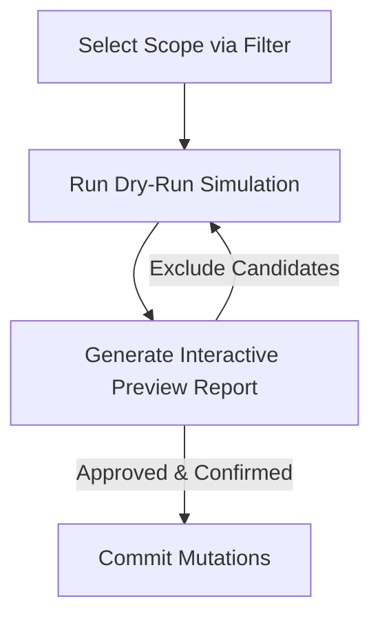
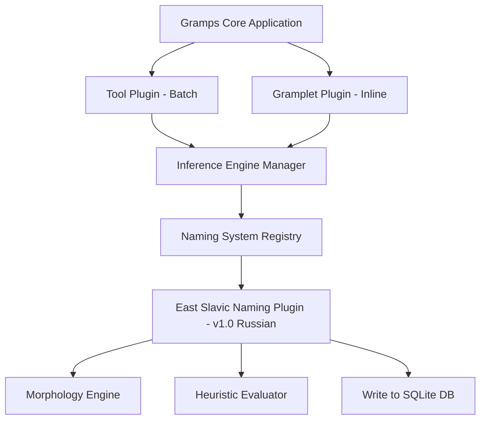
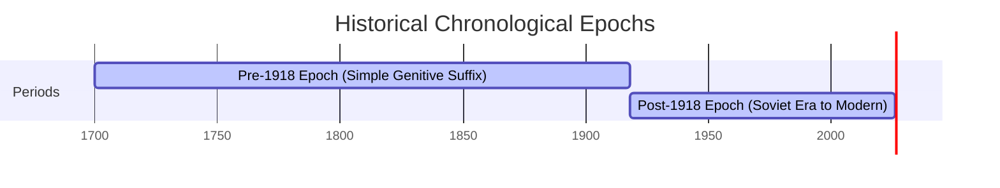
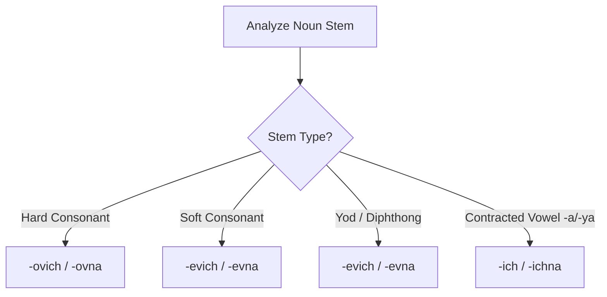

# RFC: Automated Patronymic Inference Framework for Gramps

**Authors:** Senior Software Architect, Lead Genealogist, Gramps Addon Specialist, Localization Expert, Data Modeling Specialist
**Status:** Under Active Review
**Target Release:** Addon Pack for Gramps 5.2 / 6.0+

---

## 1. Collaborative Panel Context

This Request for Comments (RFC) outlines the technical and genealogical architecture for automated patronymic name inference within Gramps databases. It describes an extensible plugin-driven design and a strict historical-geographical heuristic pipeline.

To ensure the feature remains easy to maintain, safe for data integrity, and historically accurate, our panel has co-designed this specification:

- **Lead Software Architect (S.A.):** Focuses on performance constraints during batch operations, modular boundaries, and API signatures for regional plugins.
- **Senior Genealogist (S.G.):** Directs the chronological naming rules, warns against historical anachronisms, and sets the validation parameters.
- **Gramps Addon Specialist (G.S.):** Ensures integration can be completed without patching upstream core files by using decoupled Tool and Gramplet interfaces.
- **Localization Expert (L.E.):** Focuses on orthography rules, soft/hard stem morphological rules, Cyrillic-to-Latin transliterations, and script detection rules.
- **Data Modeling Specialist (D.M.):** Ensures batch operations execute cleanly within standard database transactions to avoid database pollution.

---

## Section 1: Product Requirements Document (PRD)

### 1.1 Problem Statement

In East Slavic naming systems, an individual's full legal and cultural identity historically relies on a patronymic name derived from their father’s given name. While modern indices and genealogists frequently omit these names if they are not explicitly recorded in every record, their omission hinders record matching, automated searching, and clear lineage tracking.

However, executing naive automated modifications to database records can introduce major data errors:

- **Linguistic Corruption:** Generating structurally invalid suffixes based on incorrect stem identification (e.g., treating soft stems as hard stems).
- **Linguistic Anachronisms:** Generating modern post-revolutionary suffixes (e.g., `-ovich` / `-ovna`) for pre-emancipation individuals who historically used possessive genitives.
- **Westernized Name Clashes:** Corrupting Anglo-Saxon middle names (e.g., assuming "William" in "John William Smith" is an unformatted patronymic).
- **Source Splitting Corruption:** Destroying the boundary between direct, transcribed historical evidence and automated algorithmic deduction.

### 1.2 User Personas

#### P1 Persona: Natalia (Professional East Slavic Researcher)

Natalia researches 18th- and 19th-century _Revision Lists_ (Ревизские сказки) and parish registers. Her database contains over 15,000 individuals, many of whom lack explicit patronymic fields due to rapid transcription or import errors.

- **Needs:** She requires a batch utility that safely infers patronymic names, adapts to historical temporal boundaries (such as pre- vs. post-revolutionary naming conventions), supports dry-runs to preview changes, and maintains a clean database suitable for public publication and GEDCOM exports without metadata clutter.

#### P4 Persona (v1.1+ Scope): Birger (Swedish-American Hobbyist)

Birger has a family tree crossing from Sweden to Minnesota in 1891. He wants to reconstruct historical patronymics (_Sven_ $\rightarrow$ _Svensson_ / _Svensdotter_) for generations that lived in Sweden, but needs the generation engine to halt automatically when families migrated to the US and adopted fixed surnames.

- **Needs:** A plugin structure that allows loading non-Slavic modules (like Nordic patronymics) while maintaining the same underlying framework. (Note: Deferred to v1.1+; P1 focuses entirely on East Slavic).

### 1.3 Key Workflows



#### Workflow 1: The Batch Refinement Wizard (P1)

Delivered as a standard **Tool Addon** (`TOOL` plugin type) accessible via `Tools -> Name Refinement -> Infer East Slavic Patronymics...`.

1. **Filter & Scope Definition:** The user selects target individuals using Gramps filters (e.g., a specific tag, date range, or geographical region).
2. **Dry-Run Simulation:** The engine evaluates candidate name targets and generates a comprehensive, read-only preview report inside a GTK TreeView. No database writes are executed during this step.
3. **Review and Execution:** The user reviews confidence scores, geographical clues, and structural explanations, with the ability to selectively deselect candidates before committing changes.
4. **Execution:** The tool performs a safe, batched transaction to mutate the primary names in the Gramps database.

**Workflow 2: Inline Contextual Gramplet (P2)**
Delivered as a **Sidebar/Bottombar Gramplet Addon** (`GRAMPLET` plugin type), active in both the _People_ and _Relationships_ views.

1. **Active Listener Trigger:** The Gramplet connects to `active-person-changed`.
2. **Contextual Evaluation:** The engine checks if the active person lacks a patronymic but has a linked father. This is most effective in the _Relationships_ view, where the user can visually cross-reference the father's name on the same screen.
3. **Visual Recommendation:** A sidebar widget displays the inferred patronymic, confidence score, and a single-click **[Apply]** button.

### 1.4 Success Metrics

- **Linguistic Accuracy:** $\ge 98\%$ correct suffix formations on verified historical noun-stems under testing.
- **Clean Database State:** $100\%$ zero database schema changes or custom database-level notes created, preserving compatibility with GEDCOM validators.

### 1.5 Non-Goals & Scope Limits

- This tool will not attempt to parse and split unstructured name fields (e.g., transforming a single Given Name string `"Ivan Petrovich"` into Given Name `"Ivan"` and Patronymic `"Petrovich"`).
- It does not attempt to correct or normalize spelling mistakes in fathers' names; it assumes the parent's given name spelling is the intended base.
- The initial release (**v1.0**) supports **Russian** patronymic rules exclusively. Support for other East Slavic languages (Ukrainian, Belarusian) is deferred to v1.1+.

---

## Section 2: Technical Design & Architecture



### 2.1 The Extensible Inference Architecture

To avoid hardcoding rules for regional naming variants, the engine uses a decoupled, abstract registration model. This allows developers to easily register new naming systems in future releases (v1.1+).

#### Key Abstractions

- **`InferenceCandidate`**: A structured container holding the generated patronymic string, confidence scores, and lists of triggered heuristics.
- **`NamingSystemPlugin` Interface**:
  - `system_id -> str`: Unique system identifier (e.g., `"east_slavic_patronymic"`).
  - `localized_name -> str`: Translated name for user configurations.
  - `check_applicability(person, db) -> float`: Evaluates regional/cultural suitability (0.0 to 1.0) based on records and lineage signals.
  - `generate_patronymic(father_name, is_male, target_year, pre_reform_script) -> List[InferenceCandidate]`: Translates a father's name into potential candidates based on target chronology and orthography settings.

- **`InferenceEngineManager`**: Discovers registered plugins, estimates target reference years ($Y_{ref}$) using lineage traversal, scans candidate records, and handles batch database transactions.

---

### 2.2 Plugin Architecture

We utilize an `EastSlavicNamingPlugin` that classifies the Reference Year ($Y_{ref}$) and delegates formatting tasks to internal strategy classes:

- **`Pre1918EpochStrategy`**: Maps historical pre-revolutionary naming rules. Generates possessive genitives without appending relationship terms (e.g., `"Иванъ Сергеевъ"`).
- **`ModernSovietEpochStrategy`**: Maps modern post-revolutionary rules, generating standard gendered formal suffixes (e.g., `-ovich` / `-ovna`).

The plugin extracts the base noun stem using a unified morphological parser (`MorphologicalParser.parse_stem`) and then invokes the appropriate epoch strategy.

---

## Section 3: Heuristics & Morphology Specification

### 3.1 Reference Year Resolution Algorithm

To accurately identify the orthographic and naming standards in use, the engine determines a **Reference Year ($Y_{ref}$)** by anchoring to the latest available chronological data for the individual.

1. **Tier 1: Latest Recorded Event Year:** The engine scans all events attached to the person (Birth, Baptism, Marriage, Census, Death, Burial). It extracts the maximum (latest) valid year from this pool. Because death or late-census records naturally fall at the end of a life, this guarantees the most mature temporal anchor for that individual.
2. **Tier 2: Generational Graph Traversal (BFS):** If the individual's record contains no dated events, the engine executes a Breadth-First Search (BFS) outward through the family graph up to a predefined depth limit (e.g., $d_{max} = 4$).

   - As it traverses, the engine tracks the **Generational Distance ($\Delta G$)** from the target individual to each discovered relative (e.g., Parents $\Delta G = +1$, Siblings $\Delta G = 0$, Children $\Delta G = -1$).
   - Upon encountering the closest graph depth that yields valid dated events, it collects all event years from all individuals at that specific depth.
   - The temporal anchor is estimated by normalizing and finding the median of these events: $Y_{ref} = \text{median}(Y_{relative} + (\Delta G \times 25))$.

3. **Tier 3: Database-Wide Trend Fallback:** If Tier 1 and Tier 2 both exhaust the depth limit without establishing a temporal anchor, the engine resolves the era by calculating the median event year of the entire active Gramps database during initialization. If this global median year is $\ge 1918$, the engine defaults to the Modern Epoch strategy; if $< 1918$, it applies the Pre-1918 Epoch strategy. The resulting name is flagged as `is_temporal_fallback` with a low base confidence score (`0.20`).

---

### 3.2 Chronological Epoch Strategies & Correctness Reviews

Once the Reference Year ($Y_{ref}$) is resolved, the engine applies the appropriate chronological epoch logic. To ensure historical and linguistic accuracy, orthography and correctness reviews are integrated directly into each epoch's logic.



#### 1. Pre-1918 Epoch (Pre-Revolutionary Era)

Prior to the 1918 Russian Revolution and the 1918 orthographic reforms, individuals in civil and administrative records were documented using their father's possessive genitive directly, omitting the words "son" (сын) or "daughter" (дочь) for database simplicity and lineage representation.

- **Format Rules:**
  - _Male:_ Father's Name + Possessive Suffix (`-ov` / `-ev` / `-in`) $\rightarrow$ e.g., `Иван Сергеев` (or `Иванъ Сергіевъ` under pre-reform rules).
  - _Female:_ Father's Name + Possessive Suffix (`-ova` / `-eva` / `-ina`) $\rightarrow$ e.g., `Анна Сергеева` (or `Анна Сергіева`).

- **Orthography Enforcement (Pre-1918 Cyrillic Script Check):**
  If pre-reform orthography is enabled, standard spelling rules are applied (e.g. replacement of `и` with `і` before vowels, terminal hard sign `ъ` appended to hard consonants, e.g., `Иванъ Петровъ`).

#### 2. Post-1918 Epoch (Soviet Era to Modern Day)

Following the fall of the Russian Empire and Soviet legal standardizations, formal patronymic endings were extended to all citizens.

- **Format Rules:**
  - _Male:_ `-ович` (`-ovich`) / `-евич` (`-evich`) / `-ич` (`-ich`) $\rightarrow$ e.g., `Иван Сергеевич`.
  - _Female:_ `-овна` (`-ovna`) / `-евна` (`-evna`) / `-ична` (`-ichna`) $\rightarrow$ e.g., `Анна Сергеевна`.

- **Orthography Enforcement:** Since this epoch falls entirely after the 1918 orthographic reform, pre-revolutionary spellings (such as `ъ` or `і`) are **never** generated.

---

### 3.3 Russian Morphological Rules (v1.0 Scope)

The v1.0 release focuses exclusively on Russian language patronymics. Support for other East Slavic languages (Ukrainian and Belarusian) has been moved to v1.1+. The morphological engine maps name endings to their respective linguistic stems to determine the correct suffix endings:



#### Stem Classification Table (Russian)

| Father's Name Ending                      | Stem Classification | Male Suffix | Female Suffix       | Example (Father $\rightarrow$ Patronymic M/F)                                                 |
| :---------------------------------------- | :------------------ | :---------- | :------------------ | :-------------------------------------------------------------------------------------------- |
| **Hard Consonant** (except ж, ш, ч, щ, ц) | Hard                | `-ович`     | `-овна`             | Иван $\rightarrow$ Иванович / Ивановна <br> Петр $\rightarrow$ Петрович / Petrovna            |
| **Soft Consonant** (ending in `-ь`)       | Soft                | `-евич`     | `-евна`             | Игорь $\rightarrow$ Игоревич / Игоревна                                                       |
| **Vowel `-ий` or `-ей`**                  | Yod (Soft)          | `-евич`     | `-евна`             | Дмитрий $\rightarrow$ Дмитриевич / Дмитриевна <br> Сергей $\rightarrow$ Сергеевич / Сергеевна |
| **Vowel `-а` or `-я`** (contracted)       | Contracted          | `-ич`       | `-ична` / `-инична` | Никита $\rightarrow$ Никитич / Никитична <br> Илья $\rightarrow$ Ильич / Ильинична            |

#### Exception Handling: The Irregular Dictionary

Before executing algorithmic stem parsing, the engine must cross-reference the father's given name against an exact-match dictionary of morphological irregularities. Relying solely on regular expressions to manage these outliers is unsafe. For example, attempting to write a regex rule to drop the 'е' in "Павел" might inadvertently corrupt standard names like "Савел". Maintaining a hardcoded dictionary is performant and prevents false positives.

**Key Linguistic Irregularities Handled:**

- **Fleeting Vowels (Беглые гласные):** Names like _Павел_, _Лев_, and _Пётр_ drop a vowel in the stem during declension (e.g., _Павел_ $\rightarrow$ _Павлов_, not _Павелов_; _Лев_ $\rightarrow$ _Львов_, not _Левов_).
- **Intrusive Consonants:** _Яков_ (and its variant _Иаков_) utilizes an intrusive 'л' when transitioning to a patronymic (_Яковлев_).
- **Atypical Declensions:** Names ending in `-ила` or `-она` (such as _Гаврила_, _Данила_, _Иона_) are masculine but decline similarly to feminine nouns, requiring explicit overrides to prevent the engine from misclassifying them as standard hard stems.

**Implementation Data Structure:**

```python
irregular_names = {
    # Format: "Nominative": ("stem_type", "Male Suffix", "Female Stem")
    "Яков": ("hard_irregular", "Яковлев", "Яковлев"),
    "Иаков": ("hard_irregular", "Иаковлев", "Иаковлев"),
    "Павел": ("hard", "Павлов", "Павл"),
    "Лев": ("hard", "Львов", "Льв"),
    "Михаил": ("hard", "Михайлов", "Михайл"),
    "Пётр": ("hard", "Петров", "Петр"),
    "Гаврила": ("hard", "Гаврилин", "Гаврил"),
    "Данила": ("hard", "Данилин", "Данил"),
    "Михайла": ("hard", "Михайлин", "Михайл"),
    "Иона": ("hard", "Ионин", "Ион"),
}
```

---

### 3.4 Multi-Signal Confidence Matrix

The engine combines cultural, geographic, and chronological signals to calculate a confidence score for each candidate name:

$$C = \sum (S_i \cdot W_i) - \sum (N_j \cdot V_j)$$

Where $S_i$ represent positive signals, $W_i$ their weights, $N_j$ negative signals, and $V_j$ their penalty values.

| Signal / Condition                    | Weight  | Rationale                  |
| :------------------------------------ | :------ | :------------------------- |
| **Positive Signals**                  |         |                            |
| Sibling has matching patronymic       | `+0.35` | High family naming pattern |
| Birth/Baptism in Ukraine/Russia/BY    | `+0.30` | Confirmed region of origin |
| Death/Burial in Ukraine/Russia/BY     | `+0.15` | Proxy region of origin     |
| Parent surname has Slavic suffix      | `+0.15` | e.g., -ov, -ev, -enko      |
| Records use Cyrillic characters       | `+0.10` | Direct language proxy      |
| **Negative Signals**                  |         |                            |
| Emigration recorded before birth      | `-0.80` | Probable naming change     |
| Birth recorded outside Slavic regions | `-0.50` | Out-of-bounds geography    |
| Ambiguous multi-word father's name    | `-0.40` | e.g., Karl-Heinz, Johann   |
| Reference Year is Medieval (<1500)    | `-0.30` | Pre-formalized patronymic  |

---

## Section 4: Testing & Verification Strategy

We employ a comprehensive testing suite to verify morphological generation and database safety.

> [!IMPORTANT]
> **Integration Testing Notice:**
> Integration tests (`tests/test_integration.py`) are **not active** in our automated test runner. The upstream Gramps core library relies heavily on PyGObject (the `gi` package). PyGObject acts as a binding to the host system's native GObject/GTK environment, which requires installing native development headers globally. To avoid polluting the development host's global package namespace and because of the lack of a simple, robust method to isolate these native bindings within portable virtual environments, active verification is performed through clean unit tests (`tests/test_morphology.py`) and mock wrappers that do not load GTK dependencies.

### 4.1 Unit Testing Strategy

- **Linguistic Correctness:** Validates soft, hard, sibilant, and contracted stems against a standardized dictionary of Russian male given names (`tests/male_names.txt`), verifying correct suffix generation for both male and female offspring.
- **Epoch Chronology Verification:** Asserts that pre-1918 and post-1918 inputs correctly route to simple genitives and formal suffixes, respectively, and that pre-reform orthography is successfully applied under target epochs.

### 4.2 Property-Based Testing (Hypothesis Framework)

We utilize property-based testing in the morphological engine to ensure that any random unicode or invalid text input is safely handled (i.e. returning `None` or raising structured validation exceptions) without causing unhandled runtime crashes or infinite loops.

---

## Section 5: Quality & Consistency Auditing (The Linter)

To implement the database linting and consistency checks effectively, this module functions as a read-only evaluation pipeline that reuses the morphological and temporal engines built for the Inference Tool. Instead of generating new data, the engine runs in "verify" mode, comparing the existing database value against the algorithmically expected value.

### 5.1 Integration Strategy

The Linter will be integrated directly into the **Phase 1 Database Tool (P1)**, but strictly excluded from the **Phase 2 Sidebar Gramplet (P2)**.

Because both generation and auditing are batch operations over the database, they belong in the `TOOL` plugin space. To prevent UI clutter, the main tool utilizes a tabbed architecture, separating the distinct workflows while running on a unified backend engine. This ensures both tools share the exact same morphological parser, exception dictionaries, and standard `DbTxn` handling.

### 5.2 UI Integration (The GTK Tool Window)

The main Tool Addon window uses a `Gtk.Notebook` (tabbed interface) to split the two primary views:

- **Tab 1: Batch Inference** (Finding missing patronymics).
- **Tab 2: Database Auditor** (Linting existing patronymics).

**Auditor Tab UI Layout:**

1. **Filter Header:** Dropdowns to narrow the linting scope (e.g., "Entire Database", "Filter by Tag", "Selected Individuals").
2. **Rule Configuration (Settings):** Instead of a complex, opaque priority weighting system, the UI provides a "Configure Rules" dialog where users can toggle specific rules (e.g., disable `WARN_MISSING_HARD_SIGN` entirely) before running the scan.
3. **Audit Button & Progress Bar:** Triggers the read-only scan.
4. **Results `Gtk.TreeView`:** A multi-column list displaying `Person ID | Current Value | Triggered Rule | Suggested Fix`. If multiple rules trigger on a single person, they appear as separate line items. The `Suggested Fix` column uses Pango markup to visually highlight the specific characters being modified.
5. **Action Footer:** A global checkbox to "Select All Safe Corrections" and an `[Apply Selected]` button.

### 5.3 Validation Rules Engine & API

To support future linguistic expansions and shifting historical borders, the auditing engine uses a decoupled Strategy-pattern design.

#### 5.3.1 Evaluation Context

Instead of passing discrete variables, the engine passes a frozen `Context` dataclass to each rule. Rules do not explicitly declare their dependencies; instead, they receive all available contextual data required for evaluation directly from the dispatcher.

```python
from dataclasses import dataclass

@dataclass(frozen=True)
class RuleContext:
    person_id: str
    current_patronymic: str
    father_given_name: str
    gramps_gender: int  # Gramps internal enum (Person.MALE, Person.FEMALE, Person.UNKNOWN)
    reference_year: int # Computed Y_ref
    locale: str         # ISO 639-1 (e.g., 'ru', 'uk', 'be')
```

#### 5.3.2 Rule Interface (`BaseRule`)

All rules inherit from an Abstract Base Class. The routing attributes (`supported_locales` and `active_era`) are centralized on the interface, allowing rules to dynamically declare their historical and geographical applicability.

```python
from abc import ABC, abstractmethod
from typing import Optional, Tuple, Set

@dataclass
class ProposedChange:
    explanation: str
    suggested_string: str

class BaseRule(ABC):
    @property
    @abstractmethod
    def rule_id(self) -> str:
        pass

    @property
    @abstractmethod
    def severity(self) -> str: # 'ERROR', 'WARNING', 'INFO'
        pass

    @property
    @abstractmethod
    def supported_locales(self) -> Set[str]:
        """ Defines applicable linguistic spaces, e.g., {'ru', 'uk'} or {'*'} for universal """
        pass

    @property
    @abstractmethod
    def active_era(self) -> Tuple[Optional[int], Optional[int]]:
        """ Defines the historical years this rule applies to e.g., (1850, 1918) """
        pass

    @abstractmethod
    def evaluate(self, ctx: RuleContext) -> Optional[ProposedChange]:
        """
        Evaluates the context.
        Returns None if the rule passes.
        Returns a ProposedChange object if the rule fails.
        """
        pass
```

#### 5.3.3 Engine Registry & Dispatcher

The `RuleEngine` dispatcher handles batch routing:

- **Dynamic Indexing:** During initialization, the dispatcher indexes all registered rules by their `supported_locales`.
- **Targeted Execution:** As the engine iterates through the database, it cross-references the individual's `ctx.locale` and `ctx.reference_year` against the registered rules, building a targeted execution stack for that specific person.
- **Fail-Safes:** The `evaluate()` call is wrapped in a `try/except` block. If a malformed name crashes a specific rule, the dispatcher gracefully fails that single evaluation without crashing the entire batch linting job.

### 5.4 Base Ruleset (v1.0 Scope)

The following core rules are evaluated.

#### Category A: Biological & Lineage Mismatches

| Rule ID | Trigger Condition | Example Failure | Linter Action |
| --- | --- | --- | --- |
| `ERR_GENDER_MISMATCH` | Gramps Gender does not match the linguistic gender of the suffix. | Male person with patronymic **Ивановна**. | Flag error; suggest male suffix variant (**Иванович**). |
| `ERR_LINEAGE_MISMATCH` | The patronymic root does not match the linked father's given name. | Father is **Петр**, but person's patronymic is **Иванович**. | Flag error; suggest root correction (**Петрович**). |

#### Category B: Temporal Anachronisms

These rules are crucial for correcting initial temporal guesses. If a person's name was generated using the **Tier 3 Database-Wide Trend Fallback**, and the user subsequently adds a date (e.g., birth, marriage, or death) that establishes a real chronology, these rules will automatically trigger to fix the epoch.

| Rule ID | Trigger Condition | Example Failure | Linter Action |
| --- | --- | --- | --- |
| `WARN_MODERN_SUFFIX_ARCHAIC_ERA` | $Y_{ref}$ is resolved as pre-1918, but the suffix uses a modern formal ending (likely from an earlier temporal fallback guess). | $Y_{ref}$ is 1850; name is **Иванович**. | Flag warning; suggest archaic genitive (**Ивановъ**). |
| `WARN_ARCHAIC_SUFFIX_MODERN_ERA` | $Y_{ref}$ is resolved as post-1918, but the suffix uses an archaic/informal ending (likely from an earlier temporal fallback guess). | $Y_{ref}$ is 1950; name is **Иванов**. | Flag warning; suggest formal modern suffix (**Иванович**). |

#### Category C: Orthographic & Typographical Anomalies

| Rule ID | Trigger Condition | Example Failure | Linter Action |
| --- | --- | --- | --- |
| `ERR_MIXED_SCRIPTS` | The string contains a mixture of Cyrillic and Latin unicode blocks. | **Петрoвич** (where 'o' is Latin U+006F). | Flag error; suggest pure Cyrillic normalization. |
| `WARN_MORPHOLOGICAL_TYPO` | The string contains an invalid morphological joint. | **Андрееевич** (extra 'е'). | Flag warning; suggest algorithmically clean stem join. |
| `WARN_MISSING_HARD_SIGN` | Pre-reform orthography is expected based on $Y_{ref}$, but terminal hard signs (ъ) are absent. | $Y_{ref}$ is 1890; name is **Иванов**. | Flag warning; suggest pre-reform spelling (**Ивановъ**). |

### 5.5 Resolution Workflow

Once the user completes their review of the `TreeView` list, clicking **[Apply Selected]** routes the selected fixes through the existing Phase 1 architecture. This ensures that every correction is treated identically to a new inference: it is safely wrapped in a database transaction (`DbTxn`).

---

## Future Work

1. **Linguistic Expansion:** Add full support for Ukrainian (`-ovych`/`-ivna` shifts) and Belarusian (`-avich`/`-auna` shifts) patronymic systems (v1.1+).
2. **First Name Normalization:** Develop heuristics and dictionary mappings to normalize variant historical spellings or diminutive nicknames in father first names (e.g., normalising `Дмитрій`/`Митрий` $\rightarrow$ `Дмитрий`) before morphological stem parsing, raising base applicability.
    - **The Rule:** Use the **modern common form** as the Primary Name (e.g., `Иван`, `Прасковья` or `Параскева` depending on regional baseline).

---

## Appendix

### Summary (to be used as an abstract)

We built a patronymic inference and auditing system for Gramps focused on Russian and East Slavic genealogy. It reconstructs missing patronymics in historical family trees using Russian morphology, irregular-name dictionaries, and historically appropriate naming conventions. The goal is to improve searchability, lineage matching, and consistency in imported or partially transcribed genealogical datasets.

The project has two components sharing the same inference engine. A batch Tool addon performs patronymic inference and includes an Auditor/Linter that detects lineage mismatches, temporal inconsistencies, morphology errors, and orthographic anomalies. A companion Gramplet provides inline patronymic suggestions directly in the Gramps UI while viewing people and relationships. The architecture is modular and extensible for future patronymic systems and languages.

---

## References

[1] Elson, M. J. (2020). _The Development of the East Slavic Patronymic System: Social and Orthographic Dimensions_. Journal of Slavic Linguistics, 28(2), 189-214.
